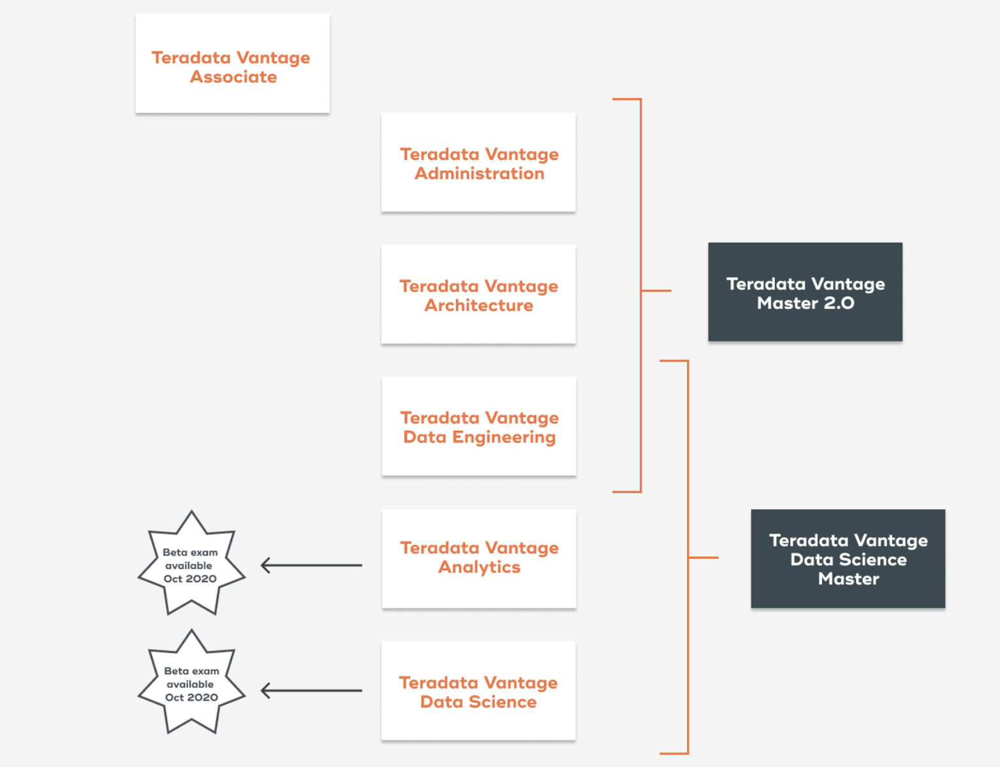

# Teradata Vantage Certification

Сертификация осуществляется через pearsonvue.com

1) Для прохождения экзамена необходима регистрирация на [сайте](https://home.pearsonvue.com/teradata)  
2) Детальная информация по экзамену Vantage Analytics Exam по [ссылке](https://www.teradata.ru/University/Certification/Vantage-Certifications/Analytics-Exam)  
3) Детальная информация по экзамену Vantage Data Science по [ссылке](https://www.teradata.ru/University/Certification/Vantage-Certifications/Data-Science-Exam)
4) Как выглядит структура экзаменов по Vantage, но здесь речь идет **только** о последних двух экзаменах:  

5) Стоимость - 75USD до 30-NOV; есть скидка - Teradata is offering a 25% discount on all Teradata Vantage exams if you test by December 31, 2020! Use the promo code “VANTAGE25” at exam registration checkout.  
Сотрудники могут получить ваучер на оплату экзамена - направляйте запрос на адрес mailto:ExamVoucher.TD@Teradata.com
6) Подготовка к экзаменам:
  * [Data Science](https://courses.teradata.com/learning/cust_ed/0000073216_Data%20Science%20Certification/html/index.html)
  * [Analytics](https://courses.teradata.com/learning/cust_ed/0000073215_Analytics%20Certification/html/index.html)
  * Для сотрудников доступны материалы на [sharepoint](https://teradata.sharepoint.com/teams/TeradataUniversityEnablement/SitePages/Teradata%20Certification.aspx)
  
